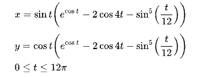
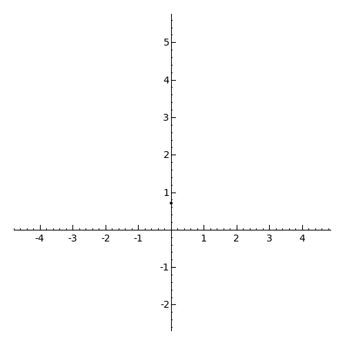

# Butterfly-SVG-Curve

A buttefly animation that was created using D3.js, built on a React framework.

For reference, I followed the Butterfly curve (transcendental) equation that was discovered by Temple H. Fay of University of Southern Mississippi in 1989.

 

## Animation

[Source](http://www.scientificlib.com/en/Mathematics/LX/ButterflyCurveTranscendental.html)
